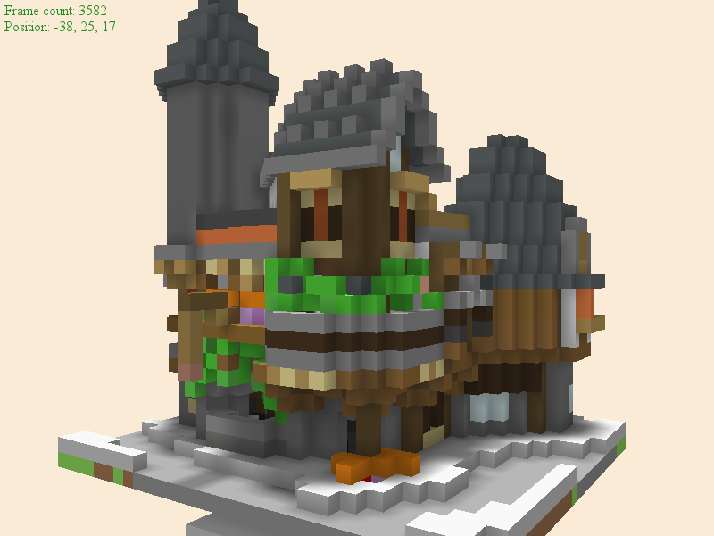
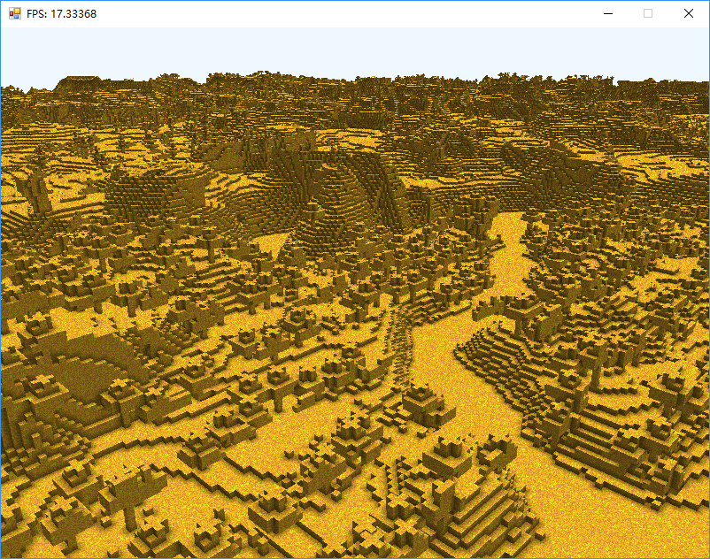

# Sandbox
An experimental rendering system and physics engine for Minecraft-like sandbox game

**Note that this project is only experimental and is not supposed to work out of the box on 
your computer.**

## Screenshots

* Rendering a Minecraft schematic file. Downloaded from 
[PlanetMinecraft](https://www.planetminecraft.com/project/whitepythagos-s-house-1/).

* Rendering a complicated Minecraft map. All blocks are rendered using one randomly generated 
texture instead of individual color to test texturing performance.

